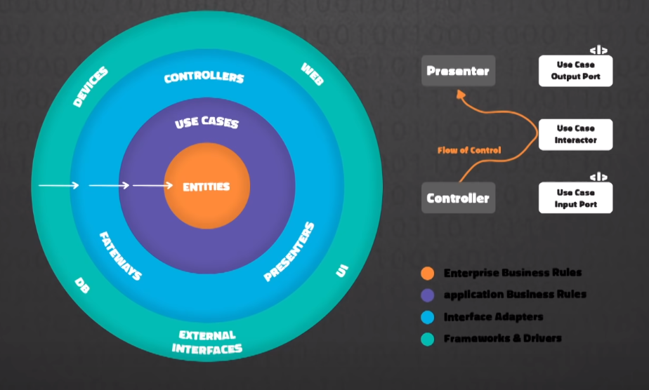

# Interview Questions

## Golang Questions

### What are the benefits of using Go compared to other languages?

- Maded by Rob Pike, Robert Griesemer and Ken Thompson - Creators of Unix , UTF-8, B and C programming languages
- Main objective is ease of programming
- Is optimized for concurrency and used to scalable applications
- Garbage collection is more efficiently than Java or Python because executes concurrently along side the program
- Efficient compilation
- Efficient execution
- Good for:
  - web services at scale - networking - http, tcp, upd
  - concurrency / parallelism

### What data types Golang uses?

- String ; Int ; UInt ; Float ; Boolean
- Array
- Slice
- Map
- Struct
- Interface
- Channel
- Pointer
- Function

### What form of type conversion does Go support? Convert an integer to a float?

- Explicit type conversion
  - i := 50
  - j := 50.1
    - x := j + float64(i) -> 100.1 -> x is of type float64

### What is a Goroutine? How do we stop it?

A Goroutine is a function that creates a different thread of execution than the main thread. This threads can run code concurrently and in parallel if the machines that runs the code has more than 1 CPU.

We can stop a go routine by sending a stop signal to the channel that go routine is using. We can achieve this by using `Wait Groups` and simply use the `Done()` wait group method and `Close()` method for the channel.

### How to check a variable type in runtime?

```golang
fmt.Printf("%T", x)
fmt.SPrintf("%T", x)

// OR:

switch v := x.(type){
    case uint64:
        //do something
    case string:
        //do something
    //...
    default:
        //do something
}
```

### How to concatenate strings?

```golang
a := "Hello"
b := "World"
c := a + " " + b
```

### What are Go interfaces and how do they work?

Interface is a type. Each interface should have a set of method signatures to define the expected behavior. Methods should not have implementation.
If any struct has implementation for the exact same methods as defined in interface, means that the type of the struct is also the type of the interface, allowing us to have polymorphism

### Can you return multiple values from a function?

Yes

```golang
func getPerson() (person models.Person, error){
    p1 := models.Person{
        name: "Bruno",
        age: 29,
    }
    return p1, nil
}
```

### Format a string without printing it?

Use `fmt.Sprintf()`

### Difference between concurrent and parallelism?

Concurrent is a design pattern that allows us to write concurrent code, meaning we can have multiple execution threads, running simultaneously, executing different pieces of code. And not only sequencing code.
Parallelism is the capacity of the machine that is running the code, to run the concurrent code in parallel. This is only achieved if the machine has more than 1 CPU. So to run code in parallel we need to run concurrent code, and have the hardware capacity to run code in parallel.

### Does go have exceptions?

No, error handling in go should be done right after the error is retrieved.

```golang
func getPerson(id string) (person models.Person, error){
    p1, err := services.getPerson(id)
    if err != nil {
        return {}, err
    }
    return p1, nil
}
```

### What is a pointer?

Is the memory address where some value is stored.

### What are the differences between unbuffered and buffered channels?

Unbuffered channel - means that is a channel without a specific number of slots

```golang
x := make(chan, int)
```

Unbuffered channel - means that we specify the specific number of slots in the channel:

```golang
y := make(chan, int, 2) // Meaning will have two slots to fill with info
```

### What is the default type of boolean?

`false`

### What is type assertion? What does it do?

When assing a value to a variable the go compiler will assert the value and add a specific type to that variable based on the value passed

```golang
x := "true" // type string
z := true // type bool
z := 64.1 // type float64
z := 64 // type int
y := make(chan, int, 2) // type chan int
```

NOTE: Type conversion is converting a type into another type `float(64)`

### Do we have `while` loop in go?

No, we can achieve the same using a for loop with a condition

```golang
x := 0
for x < 10 {
    x++
}
```

### What is the default value of error in Golang?

`nil`

### What are interfaces in golang?

- Interfaces are a type in golang.
- As in many other languages, interfaces defines behaviors.
  - So they have a set of signature methods()
- Interesting in go: We don't need to implicit implement an interface.
  - If a type implements the interface methods, then implicit is of the interface type as well
    - Allows us to have polymorphism

Declare an interface in go:

```golang
type human interface{
    speak() string
}
```

### How to instantiate a variable in go?

Type assertion by compiler -> Variable name := Value

```golang
x := 0
y := "Hello"
```

Explicit type define -> Keyword + Variable name + Type = Value

```golang
var z string = "Hello"
```

### What are the zero value?

- `int` - 0
- `string` - ""
- `bool` - false
- `slice` - []
- `map` - map[]
- `struct` - {map[]}
- `interface` - nil

### How to get the type of an object in go?

```golang
fmt.Sprintf("%T", a)

OR

switch x := a.(type){
    case a == int:
        // do something
    case a == string:
        // do something
    // ...
    default:
        // do something

}
```

### How does garbage collector works on go?

Garbage collector in go uses the "mark-sweep" technique, a process called sweeping.
Garbage collector marks the values it encounters as live, on a regular interval. Once tracing is complete, walks over all memory and marks as available for allocation, the ones that wasn't marked before.
Do this in a concurrent way that makes a huge improvement compared with other programming languages

### What are tags and how do we use it in go?

Are a way to add more metadata to fields in a struct.
Used like annotations

Common uses:

`sql packages`

```golang
type Shipment struct {
    gorm.Model
    CompanyID      string `gorm:"unique;not null;type:varchar(100);default:null"`
    TrackingNumber string `gorm:"unique;not null;type:varchar(100);default:null"`
}
```

`json packages`

```golang
type User struct {
    UserName string   `json:"username"`
    Password string   `json:"password"`
    Age      uint8    `json:"age"`  
    Sports   []string `json:"sports"`
}
```

### How can we compare two objects in go?

You can compare the two objects directly with comparison operator `==` or use the `reflect` package as `reflect.DeepEqual(a, b)`, if they have no fields of type `map` and `slice`, if so, we should implement a function that compares this data types separately.

Note that you can use `reflect.DeepEqual(map1, map2)` and `cmp.Equal(map1, map2)` to compare two data of the same type as comparison `map`'s or `slice`'s directly.

### How map works and is there a limit in go?

Map work as a `key/value` pair, where `key` is of one type and `value` of the same as key or other type.
Map initial has a limitation os 128, although there is no limit for how bigger a map can be.

## General Backend Questions

### Define clean architecture



### Clean architecture vs interfaces in golang

TODO